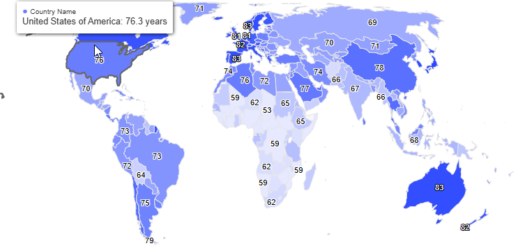

# OPCIONAL

- (OPCIONAL)datawarehouse bvase de datos con tablas preparado para consultas (herramiento de apache kylin). hacerlo de forma directa o capa intermedia ? si son pocas consltas de forma directa o con mucha flexibilidad capa intermedia

- Cada cuanto tiempo se suele hacer la obtencion de datos, deberia ser un script que se ejecute periodicamente, o estas herramientas proveen esta funcionalidad de ejecutarlo automaticamente

##

# TODO

- libreria de graficos en mapas : Highcharts Maps -> highcharts-react-official -> 

- paginacion en consulta de indicadores, debounce al buscar indicadores especificos
- LIMITAR INDICADORES DEL AREA DE SALUD

<!-- FILTROS -->

- indicadores
- regiones - paises
- años
<!--  -->

##

# 12-11

con que tipo de datos voy a trabajar

- Graficos principales:
  1- mapa
  2- graficosde barras horizontlaes

- mencionar en informe:

1 distintos graficos en dashboard
2 filtros de fecha
3 informacion agregada

- optimizacion arriba de documentacion

-Ver en su momento si vamos a necesitar consumir data en una capa intermedia para reducir consumo de api

-documentacion: de como correr el proyecto y su uso en el README

Reunion con sebastian cada 2 semanas

- Terminar informe preliminar
  1 agregar dato de tutores
  2 al enviar informe preliminar, se comunicara con un tutor de apoyo a desarrollo texto (marco teorico, etc)

##

# 5-12

<!-- Investigación de la API -->

- Al investigar sobre traducir al español los indicadores, descubri que la API posee la funcionalidad de traducir la informacion
- La API permite filtrar los indicadores por topicos, en este caso utilizaremos el de salud
- Tooltip con datos sobre cada pais al pasar el mouse sobre el mapa
- Modificando fuente de datos de paises en el mapa, traduciendo nombres y agregando continente
- Logica de seleccionar indicador y obtener valores por paises
- Filtro por año
- Busqueda de indicador por nombre o codigo

# TODO

- Logica de pintar color en el mapa dependiendo el indicador seleccionado
- ESTILIZAR Y AGREGAR DATOS AL TOOLTIP
- Decidir graficos a utilizar
- Decidir si usar filtro por año o intervalo de tiempo
- Definir los años que se tienen datos en la API
- agregar escala de valores de color (itnensidad)
- agrupar indicadores por topicos
- feature noticias/notas sobre indicador seleccionado

##

# 16-12

# AVANCES

- Decidir si usar filtro por año o intervalo de tiempo
- Definir los años que se tienen datos en la API

# 20-12

# DONE

logica de color por mapas

# VER

- al consultar indicador, cargar fechas de datos disponibles dinamicamente dependiendo datos disponibles del indicador
- que todos los indicadores tengan sentido con la escala de colores

# CONSULTAS

- Si se usa un rango de fechas, y un año no tiene datos, deberia promediar el valor del pais o como hacerlo?
- Utilizar api secudnaria en caso d eno tener datos sobre paises de el indicador seleccionado

# 24-12

# DONE

- grafico barras horizontales

# 26-12

# DONE

- FIX rerender function color map error
- fix tooltip and hover mapa

## TODO

- agrandar texto eje y grafico horizontal
- achicar mapa
- agregar un grafico principal mas? SI ES NECESARIO
- feature noticias/notas sobre indicador seleccionado ?? CAPAZ NO VA
- agrupar indicadores por topicos

<!-- CONSULTAR -->

- Si se usa un rango de fechas, y un año no tiene datos, deberia promediar el valor del pais o como hacerlo? : usar funciones a seleccioanr
- Utilizar api secudnaria en caso de no tener datos sobre paises de el indicador seleccionado

quie funcion utiliozar en rangos de fechas por indicador

<!-- pregunta: que indicador tiene datos de cada pais por año (que tantos registros haysobre los indnicadores en los paises) -->

disponibilidad O calidad de datos,
deteccion de datos anomalos

<!--  -->

grafico de progreso de indicadores, ver disponibilidad de datos, si no hay demasiados datos no permitirlo

<!--  2-1 -->

## DONE

- La base de datos que se utiliza es World Development Indicators (source id 2), viene por defecto, al acceder a la ruta "indicator"
- [FEATURE] Metadata de indicador, viene preferentemente en español, si no existe o faltan campos, trae el resto en ingles

# 7-1

## DONE

- logica valores de indicadores por fechas, en bar chart race
- logica de rango de años del indicador seleccionado

<!-- --------------------------------------------------------------------------------- -->

# 10-1

# HECHO DESDE LA ULTIMA REUNION

- [FEATURE] Metadata de indicador, viene preferentemente en español, si no existe o faltan campos, trae el resto en ingles
- [FEATURE] Bar chart race
- [FEATURE] Determinar rango de años del indicador seleccionado
- [FEATURE] Paginado graph

# FALTA

- Funcion utilizar en rangos de fechas por indicador
- Agrupar indicadores por topicos
- Estilizar pagina y graficos
- Logica de agrupar o filtrar indicadores por topicos
- Donde mostrar metadata
- Comprobar disponibilidad y calidad de los datos (deteccion de datos anomalos) ## Integrar con resto de funcionalidades

## FUNCIONALIDADES QUE DIFERENCIEN DE DASHBOARD DE BANCO MUNDIAL

- interfaz mas simple para usuario no tecnicos
- grafico de cambios en el tiempo sobre un indicador en paises
- OBTENER INFO DE OTRAS FUENTES PUBLICAS

##

# TODO 14-1

- Ocultar ver mas, al no haber mas paises

# 14-1

# Notas

- Al faltar valor de indicador en año, completar ... funcionalidad posible
- filtro posible de ultimo dato disponible, para poaises con pocos datos
- fuente secundaria, ver si los datos

# Prioridad:

filtro ultimo dato disponible
disponibilidad de datos o fuente secundaria (decidir)

29-1 fecha posible reunion

# 15-1

# DONE

[FEATURE] topics filtro

# 16-1

[FEATURE] metadata front

# 21-1

[FIX] styles topics
[AVANCE] logica de funcion en rango de años en indicadores

# 23-1

[AVANCE] funciones en rango de años

# TODO

verificar que al seleccionar vista y modificar años se utilize datavalues correctamente y no dataindicator, cuando sea un solo año o rango
